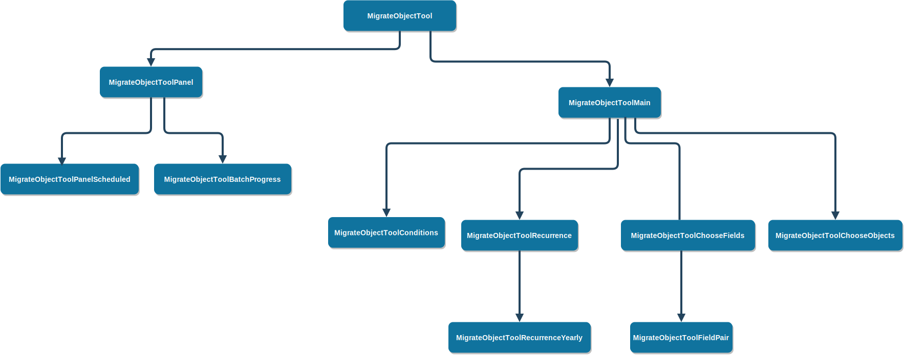

# Migrate your Custom Objects to Big Objects

> Version: 0.0.1
> Author: Solumate

## Introduction

TODO

## About the project

- Step 1

  ```
  Choose Objects. TODO: add description
  ```

- Step 2

  ```
  Choose Fields. TODO: add description
  ```

- Step 3

  ```
  Query. TODO: add description
  ```

- Step 4

  ```
  Scheduling. TODO: add description
  ```

## Component Structure



---
